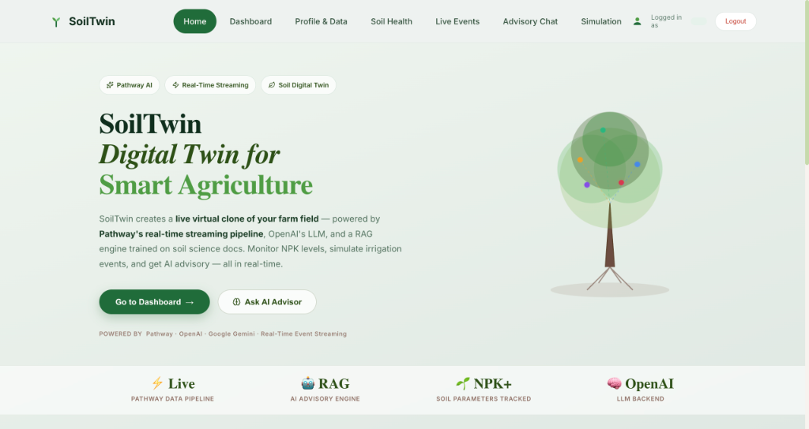
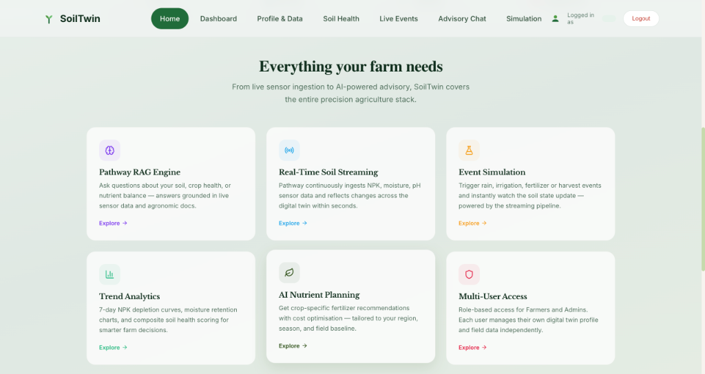
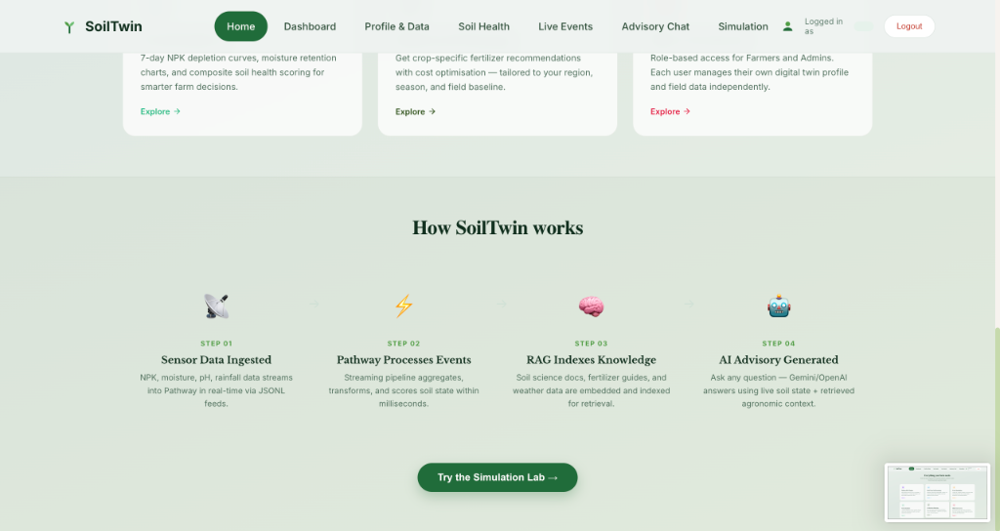
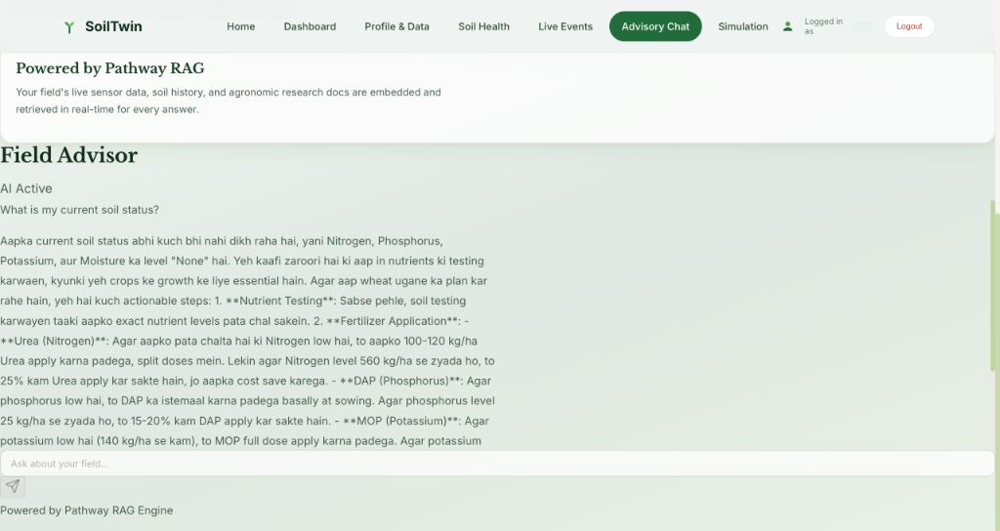

<div align="center">

<h1>🌱 SoilTwin</h1>
<h3>Real-Time Soil Digital Twin for Smart Agriculture</h3>

<p>
  
  
  
  
  
  
  
</p>

<p><em>SoilTwin creates a <strong>live virtual clone of your farm field</strong> — powered by Pathway's real-time streaming pipeline, OpenAI's LLM, and a RAG engine trained on soil science docs. Monitor NPK levels, simulate irrigation events, and get AI advisory — all in real-time.</em></p>

</div>

---

## 📸 Screenshots

| Hero & Landing | Features Overview |
|:-:|:-:|
|  |  |

| How It Works | Advisory Chat (RAG) | Live Events Stream |
|:-:|:-:|:-:|
|  |  |  |

> **Note**: Screenshots show the live application. The Advisory Chat features RAG-powered responses in Hinglish (Hindi+English) grounded in real soil data.

---

## 🚀 Key Features

| Feature | Description |
|---|---|
| 🔴 **Real-Time Digital Twin** | Continuously updates N, P, K, Moisture, and pH in real-time via Pathway streaming |
| ⚡ **Event Simulation Lab** | Trigger Rain, Irrigation, Fertilizer, and Harvest events and instantly watch soil state update |
| 🧠 **Pathway RAG Engine** | Ask any question — answers grounded in live soil state + ICAR/FCO agronomic knowledge base |
| 📊 **Trend Analytics** | 7-day NPK depletion curves, moisture retention charts, and composite soil health scoring |
| 🤖 **AI Nutrient Planning** | Crop-specific fertilizer recommendations with cost-optimisation tailored to your region and season |
| 🌐 **Multi-User Access** | Role-based access (Farmer / Admin). Each user manages their own digital twin profile and field data independently |
| 🌦️ **Live Weather Integration** | OpenWeatherMap integration to stream real-time rainfall into the Pathway pipeline |
| 📁 **Soil Report Upload** | Upload PDF/JPEG soil reports to AWS S3 for persistent storage |
| 🔒 **JWT Auth + Refresh Tokens** | Secure login with JWT access tokens (30 min) + long-lived refresh tokens (30 days) |

---

## 🏗️ How SoilTwin Works

```
STEP 01                 STEP 02                  STEP 03                  STEP 04
Sensor Data             Pathway Processes         RAG Indexes              AI Advisory
  Ingested  ──────────▶   Events       ──────────▶  Knowledge   ──────────▶  Generated

NPK, moisture,          Streaming pipeline        Soil science docs,       Ask any question —
pH, rainfall data       aggregates, transforms,   fertilizer guides, and   Gemini/OpenAI answers
streams into            and scores soil state     weather data are         using live soil state
Pathway in real-        within milliseconds.      embedded and indexed     + retrieved agronomic
time via JSONL                                    for retrieval.           context.
feeds.
```

### Data Flow Architecture

```
┌─────────────────────────────────────────────────────────────────────┐
│                         SoilTwin Architecture                       │
│                                                                     │
│  ┌──────────────┐    ┌────────────────────────────────────────────┐ │
│  │  Data Sources│    │            Pathway Pipeline                │ │
│  │              │    │                                            │ │
│  │ • SHC CSV    │───▶│  JSONL Streams ──▶ Schema ──▶ compute_    │ │
│  │ • Rain JSONL │    │                             deltas()       │ │
│  │ • Fert JSONL │    │  groupby(user_id).reduce() ──▶ join_left  │ │
│  │ • Irri JSONL │    │                             (SHC base)    │ │
│  │ • Weather API│    │  ──▶ current_state.csv ──▶ recent_events  │ │
│  └──────────────┘    └────────────────────────────────────────────┘ │
│                                         │                           │
│                                         ▼                           │
│                          ┌─────────────────────────┐               │
│                          │     FastAPI Backend      │               │
│                          │                          │               │
│                          │ /soil-state  /events     │               │
│                          │ /ask  /history  /profile │               │
│                          │ /login  /register        │               │
│                          │ /upload-soil-report      │               │
│                          └────────────┬────────────┘               │
│                                       │                             │
│                          ┌────────────▼────────────┐               │
│                          │      React Frontend      │               │
│                          │                          │               │
│                          │  Dashboard │ Soil Health │               │
│                          │  Advisory  │ Live Events │               │
│                          │  Simulation│ Profile     │               │
│                          └─────────────────────────┘               │
└─────────────────────────────────────────────────────────────────────┘
```

---

## 🛠️ Tech Stack

### Core Intelligence
| Component | Technology | Purpose |
|---|---|---|
| **Streaming Engine** | [Pathway](https://pathway.com/) (Python) | Real-time event processing, stateful reducers, JSONL ingestion |
| **RAG Vector Store** | Pathway + Sentence Transformers | Semantic search over agronomic documents |
| **LLM** | OpenAI GPT-4o-mini | Advisory chat responses in Hinglish/English |
| **Weather** | OpenWeatherMap API | Live rainfall ingestion into Pathway stream |

### Backend
| Component | Technology | Purpose |
|---|---|---|
| **API Framework** | FastAPI | REST API with async support |
| **Auth** | JWT + Bcrypt + Refresh Tokens | Secure multi-user authentication |
| **Database** | MongoDB + PyMongo | User accounts, events, soil reports |
| **Rate Limiting** | SlowAPI | Abuse prevention (5 logins/min, 10 asks/min) |
| **Storage** | AWS S3 | Soil report file uploads |
| **Server** | Uvicorn | ASGI server |

### Frontend
| Component | Technology | Purpose |
|---|---|---|
| **Framework** | React 18 + Vite | SPA with fast HMR |
| **Styling** | Tailwind CSS | Utility-first CSS |
| **Routing** | React Router | Multi-page navigation |
| **State** | React Context | Auth and app state management |
| **Charts** | Recharts / Custom SVG | NPK trend lines, gauges |

### DevOps
| Component | Technology |
|---|---|
| **Containerization** | Docker + Docker Compose |
| **Process Management** | `start.sh` shell supervisor |
| **WSL Support** | `SETUP_WSL.md` guide for Windows |

---

## 📁 Directory Structure

```
SoilTwin/
│
├── 📂 backend/                    # FastAPI Backend
│   ├── main.py                    # App entrypoint + CORS config
│   ├── api_routes.py              # All API endpoints (auth, soil, RAG, events)
│   ├── auth.py                    # JWT token creation & verification
│   ├── simulation_engine.py       # Optimistic soil state calculator
│   ├── database.py                # MongoDB connection setup
│   ├── seed_db.py                 # Initial user seeding script
│   ├── Dockerfile                 # Backend container definition
│   ├── 📂 models/                 # Pydantic data models
│   └── 📂 crud/                   # Database operations
│       ├── user_crud.py
│       ├── password_reset_crud.py
│       ├── refresh_token_crud.py
│       └── soil_report_crud.py
│
├── 📂 pathway_pipeline/           # Pathway Streaming Core
│   ├── main_pipeline.py           # Main pipeline: ingest → reduce → write CSV
│   ├── streaming_logic.py         # Delta computation (rain/fert/irri/harvest)
│   ├── soil_twin_state.py         # SoilState class + status thresholds
│   ├── rag_store.py               # Vector store setup + semantic query
│   ├── embedding_service.py       # Sentence-transformer embeddings
│   ├── ingest.py                  # Soil Health Card CSV loader
│   └── weather_api.py             # OpenWeatherMap → JSONL writer
│
├── 📂 frontend/                   # React SPA
│   └── 📂 src/
│       ├── App.jsx                # Router + protected routes
│       ├── 📂 components/
│       │   ├── Home.jsx           # Landing + hero + features
│       │   ├── Dashboard.jsx      # NPK gauges + weather widget
│       │   ├── SoilHealth.jsx     # Trend charts + health score
│       │   ├── ChatBox.jsx        # RAG advisory chatbot
│       │   ├── LiveEvents.jsx     # Real-time event stream + history
│       │   ├── Simulation.jsx     # Event simulation lab
│       │   └── ProfileData.jsx    # User profile & field data
│       └── 📂 context/
│           └── AuthContext.jsx    # JWT login state management
│
├── 📂 data/                       # Data Layer
│   ├── 📂 soil_health_card/
│   │   └── sample_shc.csv         # Initial NPK baselines per user
│   └── 📂 simulated_streams/
│       ├── rainfall_stream.jsonl  # Watched by Pathway (append-only)
│       ├── fertilizer_events.jsonl
│       ├── irrigation_events.jsonl
│       └── live_weather.jsonl     # Written by weather_api.py
│
├── 📂 docs/                       # RAG Knowledge Base
│   ├── fertilizer_guidelines.txt  # ICAR fertilizer norms
│   ├── crop_nutrient_rules.txt    # Crop-specific NPK rules
│   └── soil_science_basics.txt    # General agronomy context
│
├── docker-compose.yml             # Multi-service container orchestration
├── requirements.txt               # Python dependencies
├── start.sh                       # One-command full startup script
├── setup_dev.sh                   # WSL/Linux dev setup helper
├── .env.example                   # Environment template
└── SETUP_WSL.md                   # Windows WSL2 guide
```

---

## ⚙️ Prerequisites

- **Python** 3.10 or higher
- **Node.js** 18+ and npm
- **MongoDB** running locally (or MongoDB Atlas URI)
- **API Keys**:
  - `OPENAI_API_KEY` — Required for RAG advisory chat
  - `OPENWEATHER_API_KEY` — Optional (falls back to mock data)
  - `DATA_GOV_IN_API_KEY` — Optional (for OGD data proxy)
- **Windows Users**: Must use **WSL2 (Ubuntu)**. See [`SETUP_WSL.md`](./SETUP_WSL.md) for a detailed guide.

---

## 🔧 Installation

### 1. Clone the Repository

```bash
git clone https://github.com/<your-username>/SoilTwin.git
cd SoilTwin
```

### 2. Configure Environment Variables

Copy the example file and fill in your keys:

```bash
cp .env.example .env
```

```env
# Required: OpenAI for RAG Advisory Chat
OPENAI_API_KEY=sk-proj-xxxxxxxxxxxxxxxxxxxxxxxx

# Optional: Live weather ingestion into Pathway
OPENWEATHER_API_KEY=your_openweather_key

# JWT Security (change in production!)
JWT_SECRET=development_secret_key_123

# MongoDB connection
MONGODB_URL=mongodb://localhost:27017/soiltwin_db
MONGODB_DB_NAME=soiltwin_db

# Optional: AWS S3 for soil report uploads
AWS_ACCESS_KEY_ID=your_key
AWS_SECRET_ACCESS_KEY=your_secret
```

### 3. Install Backend Dependencies

```bash
python -m venv .venv
source .venv/bin/activate    # Windows WSL: source .venv/bin/activate
pip install -r requirements.txt
```

### 4. Install Frontend Dependencies

```bash
cd frontend
npm install
cd ..
```

### 5. Seed the Database

```bash
python -m backend.seed_db
```

This creates the demo user accounts in MongoDB.

---

## ▶️ Running the Application

### Option 1: Quick Start (Recommended)

The all-in-one startup script launches Pathway, Backend, and Frontend:

```bash
./start.sh
```

This will:
1. Start the **Pathway streaming pipeline** (background)
2. Start the **FastAPI backend** on `http://localhost:8000`
3. Start the **React frontend** on `http://localhost:5173`
4. Monitor all three processes

### Option 2: Manual Start (3 separate terminals)

**Terminal 1 — Pathway Engine (The Digital Twin)**
```bash
source .venv/bin/activate
python -m pathway_pipeline.main_pipeline
```

**Terminal 2 — FastAPI Backend**
```bash
source .venv/bin/activate
uvicorn backend.main:app --reload --port 8000
```

**Terminal 3 — React Frontend**
```bash
cd frontend
npm run dev
```

### Option 3: Docker Compose

```bash
docker-compose up --build
```

- Backend: `http://localhost:8000`
- Frontend: `http://localhost:3000`

---

## 🔑 Demo Accounts

| Username | Password | Role | Location |
|---|---|---|---|
| `farmer` | `farmer123` | Farmer | Karnal, Haryana |
| `farmer2` | `farmer123` | Farmer | Ludhiana, Punjab |
| `admin` | `admin123` | Admin | — |

> Each farmer account maintains **complete data isolation** — separate soil states, event history, and profile data.

---

## 🧪 Usage Guide

1. Open the app at **`http://localhost:5173`**
2. **Login** with one of the demo accounts above
3. **Dashboard** — View live NPK gauges with Red/Yellow/Green status indicators and weather widget
4. **Simulate Rain** — Go to Simulation → Click "Heavy Rain" → Watch Nitrogen leach and Moisture rise instantly
5. **Apply Fertilizer** — Click "Add Urea (50kg)" → See Nitrogen spike in real-time
6. **Soil Health** — View 7-day trends for N, P, K and composite soil health score
7. **Advisory Chat** — Ask *"My nitrogen is low, what should I do?"* → Get RAG-powered Hinglish advice grounded in ICAR guidelines and your live soil data
8. **Live Events** — See the real-time Pathway pipeline event stream and full audit trail
9. **Profile & Data** — Update your farm profile, field details, and upload soil reports

---

## 🌐 API Reference

Base URL: `http://localhost:8000/api`

### Authentication

| Method | Endpoint | Description | Auth Required |
|---|---|---|---|
| `POST` | `/login` | Login, returns JWT + refresh token | No |
| `POST` | `/register` | Register new farmer account | No |
| `POST` | `/refresh` | Refresh expired access token | No |
| `POST` | `/logout` | Revoke refresh token | No |
| `POST` | `/forgot-password` | Generate 6-digit reset code | No |
| `POST` | `/reset-password` | Reset password with code | No |
| `GET` | `/me` | Get current user profile | ✅ Yes |

### Soil Data

| Method | Endpoint | Description | Auth Required |
|---|---|---|---|
| `GET` | `/soil-state` | Get current NPK/Moisture state (Pathway output) | ✅ Yes |
| `POST` | `/events` | Inject event (rain/irrigation/fertilizer/harvest) | ✅ Yes |
| `GET` | `/history` | Get event audit trail for current user | ✅ Yes |
| `GET` | `/profile` | Get farmer profile | ✅ Yes |
| `POST` | `/upload-soil-report` | Upload PDF/JPEG report to S3 | ✅ Yes |

### AI & External

| Method | Endpoint | Description | Auth Required |
|---|---|---|---|
| `POST` | `/ask` | RAG-powered Q&A about your field | ✅ Yes |
| `GET` | `/external/weather` | Live weather for your location | No |
| `GET` | `/external/ogd/{resource_id}` | Proxy to data.gov.in | No |

### Rate Limits

| Endpoint | Limit |
|---|---|
| `/login` | 5 requests/minute |
| `/register` | 3 requests/minute |
| `/ask` | 10 requests/minute |
| `/forgot-password` | 3 requests/minute |

---

## 🔬 Pathway Pipeline Deep Dive

The core of SoilTwin is the **Pathway streaming engine** in `pathway_pipeline/main_pipeline.py`.

### How the Pipeline Works

```python
# 1. Load Static Base State (Soil Health Card)
shc_table = load_soil_health_card("data/soil_health_card/sample_shc.csv")

# 2. Stream live JSONL event files (Pathway watches for new appends)
rain = pw.io.jsonlines.read("data/simulated_streams/rainfall_stream.jsonl",
                             schema=RainSchema, mode="streaming")
fert = pw.io.jsonlines.read("data/simulated_streams/fertilizer_events.jsonl", ...)
irri = pw.io.jsonlines.read("data/simulated_streams/irrigation_events.jsonl", ...)

# 3. Compute deltas per event (rain leaches N, urea adds N, etc.)
events_processed = events.select(
    user_id=pw.this.user_id,
    deltas=pw.apply(compute_deltas, pw.this.event_type, pw.this.data)
)

# 4. Stateful reducer: sum all deltas per user
event_effects = events_processed.groupby(pw.this.user_id).reduce(
    d_n=pw.reducers.sum(...), d_p=..., d_k=..., d_m=...
)

# 5. Join base state + effects → final digital twin state
final_state = shc_table.join_left(event_effects, ...).select(
    nitrogen = base_n + d_n,
    phosphorus = base_p + d_p,
    ...
)

# 6. Write to CSV for API consumption
pw.io.csv.write(final_state, "data/current_state.csv")
```

### Soil Delta Computation Rules

| Event | Effect on Nutrients |
|---|---|
| Rain (1mm) | N: −0.8 kg/ha (leaching), Moisture: +0.4% |
| Irrigation (1L) | Moisture: +0.0005% per liter |
| Urea (1kg) | N: +0.46 kg/ha (46% nitrogen content) |
| DAP (1kg) | N: +0.18 kg/ha, P: +0.46 kg/ha |
| MOP/Potash (1kg) | K: +0.60 kg/ha |
| Wheat Harvest | N: −80, P: −15, K: −60 kg/ha |
| Rice Harvest | N: −90, P: −20, K: −70 kg/ha |
| FYM Manure (1kg) | N: +0.005, P: +0.002, K: +0.005 kg/ha |

### Status Thresholds (Red / Yellow / Green)

| Parameter | Low (Red) | Medium (Yellow) | High (Green) |
|---|---|---|---|
| Nitrogen | < 280 kg/ha | 280–560 kg/ha | > 560 kg/ha |
| Phosphorus | < 11 kg/ha | 11–22 kg/ha | > 22 kg/ha |
| Potassium | < 110 kg/ha | 110–280 kg/ha | > 280 kg/ha |
| Moisture | < 20% | 20–60% | > 60% |

---

## 🤖 RAG Advisory System

The Advisory Chat uses a **full 5-step RAG pipeline**:

```
1. Embed Query       → sentence-transformers/all-MiniLM-L6-v2
2. Vector Search     → Pathway vector store (cosine similarity, top-k=3)
3. Retrieve Context  → Relevant chunks from ICAR/FCO knowledge base
4. Inject Context    → Combined with live soil state from Pathway CSV
5. LLM Generation   → OpenAI GPT-4o-mini with Hinglish system prompt
```

Knowledge base documents (in `docs/`):
- `fertilizer_guidelines.txt` — ICAR fertilizer application norms
- `crop_nutrient_rules.txt` — Crop-specific NPK requirements
- `soil_science_basics.txt` — General agronomy and soil health context

**Offline fallback**: If OpenAI API is unavailable, a deterministic rule-based expert system provides actionable advice using the current soil state values directly.

---

## 🐳 Docker Deployment

```bash
# Build and run all services
docker-compose up --build

# Backend available at: http://localhost:8000
# Frontend available at: http://localhost:3000

# For production, update VITE_API_URL in docker-compose.yml
args:
  - VITE_API_URL=http://your-server-ip:8000
```

---

## 🗂️ Environment Variables Reference

| Variable | Required | Description |
|---|---|---|
| `OPENAI_API_KEY` | ✅ Yes | OpenAI API key for GPT-4o-mini advisory chat |
| `OPENWEATHER_API_KEY` | Optional | Live weather for Pathway pipeline (mock fallback if missing) |
| `JWT_SECRET` | ✅ Yes | Secret for signing JWT tokens |
| `MONGODB_URL` | ✅ Yes | MongoDB connection string |
| `MONGODB_DB_NAME` | ✅ Yes | MongoDB database name |
| `DATA_GOV_IN_API_KEY` | Optional | data.gov.in API key for OGD proxy |
| `AWS_ACCESS_KEY_ID` | Optional | AWS credentials for S3 soil report upload |
| `AWS_SECRET_ACCESS_KEY` | Optional | AWS credentials for S3 soil report upload |

---

## 🧩 Frontend Pages

| Page | Route | Description |
|---|---|---|
| **Home** | `/` | Hero, feature cards, "How it works" flow, CTA |
| **Dashboard** | `/dashboard` | Live NPK gauges, weather widget, quick event triggers |
| **Soil Health** | `/soil-health` | 7-day NPK trends, moisture retention, health score |
| **Profile & Data** | `/profile` | Farm profile, field details, soil report upload |
| **Live Events** | `/live-events` | Real-time Pathway stream, filterable audit trail, CSV export |
| **Advisory Chat** | `/chat` | RAG-powered AI chatbot (Powered by Pathway RAG Engine) |
| **Simulation** | `/simulation` | Event simulation lab — trigger & observe soil state changes |

---

## 🔭 Research & Data Sources

- ICAR (Indian Council of Agricultural Research) fertilizer norms
- FCO (Fertilizer Control Order) guidelines
- Soil Health Card (SHC) scheme data format (GoI)
- OpenWeatherMap API for live meteorological data
- data.gov.in for open government agricultural datasets

See [`RESEARCH_SOURCES.md`](./RESEARCH_SOURCES.md) for full citations.

---

## 🛡️ Security Features

- **JWT Access Tokens** — 30-minute expiry, signed with HS256
- **Refresh Tokens** — 30-day expiry, stored in MongoDB, revoked on logout
- **Rate Limiting** — SlowAPI middleware on all sensitive endpoints
- **Password Hashing** — bcrypt with salt rounds
- **CORS** — Configured to allow only trusted origins
- **Input Validation** — Pydantic models with field validators on all request bodies
- **Data Isolation** — All queries filtered by `user_id` derived from JWT — no cross-user data leakage

---

## 📄 License

MIT License — Built for Advanced Agentic Coding Assessment.

See [`LICENSE`](./LICENSE) for full terms.

---

<div align="center">

**Built with ❤️ for Indian Farmers**

*Powered by* · [Pathway](https://pathway.com/) · [OpenAI](https://openai.com/) · [Google Gemini](https://gemini.google.com/) · Real-Time Event Streaming

</div>
